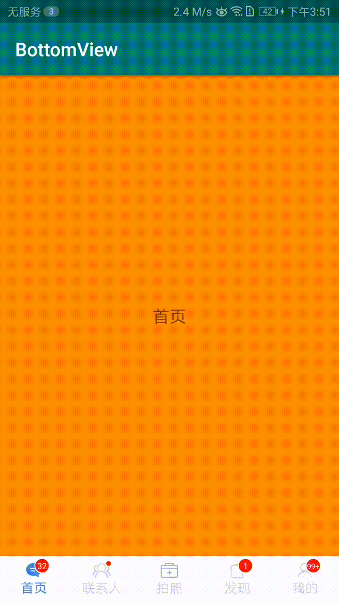

# [OneBottomNavigationBar](https://github.com/onestravel/OneBottomNavigationBar) 使用说明

## 简介：

##### OneBottomNavigationBar 是自定义的一个实现App应用底部导航栏功能的View,可以实现底部 2-5 个导航菜单（一般不会有更多），可以实现某一个菜单凸起的效果，如，有5个菜单，可以选择让第三个菜单凸起（floating），这是很多App都有的功能; 可以根据编写的颜色变化的资源文件来更改图标和文字选中时和未选中时的颜色，可以自由控制是否需要选中（checkable）,选择开启时，可变换为选中颜色，选择关闭时，不能更改为选择颜色;可以控制默认选中哪一项；可以设置某一个导航菜单的未读消息数（数字或者小红点）。

### 先看一组效果图

#### 五个菜单，没有凸起的，都是可选中的



<center>图1</center>

#### 中间有凸起，并且中间的不能选中，但点击事件可以响应


<center>图2</center>

## 引入方法

### jcenter

VERSION:     [  ](https://bintray.com/onestravel/one/OneBottomNavigationBar)

- 在model 中的build.gradle 中增加依赖

```
dependencies {
    implementation 'cn.onestravel.one:one_bottom_navigationbar:VERSION'
}

```
例如：
```
dependencies {
    implementation 'cn.onestravel.one:one_bottom_navigationbar:1.1.1'
}
```

### jitPack

VERSION:     [](https://jitpack.io/#onestravel/BottomNavigationBar)


- 在项目中的根目录下的 build.gradle (与model同级的) 中增加如下配置

```

	allprojects {
		repositories {
			...
			maven { url 'https://jitpack.io' }
		}
	}

```

- 在model 中的build.gradle 中增加依赖

```
dependencies {
    implementation 'com.github.onestravel:OneBottomNavigationBar:VERSION'
}

```
例如：
```
dependencies {
     implementation 'com.github.onestravel:OneBottomNavigationBar:1.1.1'
}
```

## 属性说明

### OneBottomNavigationBar 属性说明

| 属性               | 参考值                 | 说明                                                         |
| ------------------ | ---------------------- | ------------------------------------------------------------ |
| app:oneItemIconTint   | @drawable/tab_selecter | 整体的tab菜单的图片选中和未选中的颜色变化，传入一个资源drawable文件 |
| app:oneItemTextColor  | @drawable/tab_selecter | @drawable/tab_selecter@drawable/tab_selecter整体的tab菜单的图片选中和未选中的颜色变化，传入一个资源drawable文件 |
| app:oneFloatingEnable | true/false             | 是否开启浮动，默认为false，设置为true是，可以实现中间凸起    |
| app:oneFloatingUp     | 20dp                   | 设置Tab的上浮尺寸，比如：上浮20dp，上浮尺寸不可超过整个菜单高度的1/2 |
| app:oneMenu           | @menu/botom_menu       | BottomNavigationBar导航栏的关键，设置导航栏的tab菜单                  |
| app:oneItemTextSize   | 15sp       | 设置导航栏文字的大小                 |
| app:oneItemIconWidth   | 30dp       | 设置导航栏Icon的宽度                 |
| app:oneItemIconHeight   | 30dp       | 设置导航栏Icon的高度                |
| app:oneItemTextTopMargin   | 5dp       | 设置导航栏文字和Icon的间隔高度                  |
| app:oneItemTopLineColor   |#CCCCCC       | 设置导航栏顶部分割线颜色，想去掉该分割线可设置透明色                  |
| app:oneItemPadding   |5dp      | 设置正常导航栏上下边距                 |
| app:oneFloatingPadding   |2dp       | 设置浮动导航栏上下边距                   |


#### 示例1:不需要浮动（凸起）的菜单，图1效果

```

    <cn.onestravel.navigation.view.OneBottomNavigationBar
        android:id="@+id/BottomLayout"
        android:layout_width="match_parent"
        android:layout_height="50dp"
        android:layout_alignParentBottom="true"
        android:background="@android:color/white"
        android:paddingTop="5dp"
        android:paddingBottom="5dp"
        app:menu="@menu/navigation_menu">

    </cn.onestravel.navigation.view.OneBottomNavigationBar>
    
```

#### 示例2:需要浮动（凸起）的菜单，图2效果

```
 <cn.onestravel.navigation.view.OneBottomNavigationBar
        android:id="@+id/BottomLayout"
        android:layout_width="match_parent"
        android:layout_height="50dp"
        android:layout_alignParentBottom="true"
        android:background="@android:color/white"
        android:paddingTop="5dp"
        android:paddingBottom="5dp"
        app:floatingEnable="true"
        app:floatingUp="25dp"
        app:menu="@menu/navigation_menu">

    </cn.onestravel.navigation.view.OneBottomNavigationBar>
```

### menu 菜单属性值说明

| 属性              | 参考值             | 说明                                                         |
| ----------------- | ------------------ | ------------------------------------------------------------ |
| android:id        | @+id/tab1          | 导航菜单 Item 的ID；                                         |
| android:icon      | @drawable/bar_news | 导航菜单 Item 的图标，可以是图标选择器（selector），也可以是默认图标，根据与OneBottomNavigationBar 的属性 app:oneItemIconTint 更改选中与不选中的颜色变化，默认为蓝色和灰色； |
| android:title     | 首页               | 导航菜单 Item 的文字，可以默认为空字符串，表示不设置；       |
| android:checkable | true/false         | 设置导航菜单 Item 是否可以选择，值影响选择与不选中效果，不影响点击事件； |
| android:checked   | true/false         | 设置导航菜单 Item 是否默认选中,默认为第一个选中，请不要在多个Item上设置改； |
| app:floating      | true/false         | 设置该导航菜单 Item 是否浮动，与OneBottomNavigationBar 的app:floatingEnable和 app:oneFloatingUp属性配合使用，默认为false，即不浮动（不凸起）； |

#### 示例1:不需要浮动（凸起）的菜单，图1效果

```
<?xml version="1.0" encoding="utf-8"?>
<menu xmlns:android="http://schemas.android.com/apk/res/android"
    xmlns:app="http://schemas.android.com/apk/res-auto">

    <item
        android:id="@+id/tab1"
        android:icon="@drawable/bar_news"
        android:title="首页"></item>
    <item
        android:id="@+id/tab2"
        android:icon="@drawable/bar_constact"
        android:title="联系人"></item>
    <item
        android:id="@+id/tab5"
        android:icon="@drawable/tab_manage_selected"
        android:title="拍照"></item>
    <item
        android:id="@+id/tab3"
        android:icon="@drawable/bar_invite"
        android:title="发现"></item>
    <item
        android:id="@+id/tab4"
        android:icon="@drawable/bar_my"
        android:title="我的"></item>
</menu>
```

#### 示例2:需要浮动（凸起）的菜单，图2效果

```
<?xml version="1.0" encoding="utf-8"?>
<menu xmlns:android="http://schemas.android.com/apk/res/android"
    xmlns:app="http://schemas.android.com/apk/res-auto">

    <item
        android:id="@+id/tab1"
        android:icon="@drawable/bar_news"
        android:title="首页"></item>
    <item
        android:id="@+id/tab2"
        android:icon="@drawable/bar_constact"
        android:title="联系人"></item>
    <item
        android:id="@+id/tab5"
        android:icon="@drawable/tab_manage_selected"
        android:title="拍照"
        app:floating="true"
        android:checkable="false"></item>
    <item
        android:id="@+id/tab3"
        android:icon="@drawable/bar_invite"
        android:title="发现"></item>
    <item
        android:id="@+id/tab4"
        android:icon="@drawable/bar_my"
        android:title="我的"></item>
</menu>
```

### 设置点击切换监听
**在NavigationBar的Tab进行切换时，会回调改方法，可进行相应处理，如：未读消息数设置**
```
        bottomView.setOnItemSelectedListener(new OneBottomNavigationBar.OnItemSelectedListener() {
                    @Override
                    public void onItemSelected(OneBottomNavigationBar.Item item, int position) {
                        if(position==2){
                            bottomView.setFloatingEnable(true);
                        }else {
                            bottomView.setFloatingEnable(false);
                        }
                    }
                });
```

### 添加Fragment进行管理，点击自动切换
**1. 需要先设置FragmentManager管理器和加载Fragment的ViewGroup,一般为FrameLayout ,需要设置id;之后调用addFragment，为对应的Tab添加Fragment,**
```java
        bottomView.setFragmentManager(getFragmentManager(),mainFragment);
        bottomView.addFragment(R.id.tab1,new FirstFragment());
        bottomView.addFragment(R.id.tab2,new SecondFragment());
        bottomView.addFragment(R.id.tab3,new ThirdFragment());
        bottomView.addFragment(R.id.tab4,new FourFragment());
        bottomView.addFragment(R.id.tab5,new FiveFragment());
```
**2. 使用 ViewPager 来管理切换 Fragment** begin 1.2.4-beta
java

```java
        ArrayList<Fragment>  fragments = new ArrayList<>();
        fragments.add(new FirstFragment());
        fragments.add(new SecondFragment());
        fragments.add(new ThirdFragment());
        fragments.add(new FourFragment());
        fragments.add(new FiveFragment());
        bottomView.attachViewPager(getSupportFragmentManager(),viewPager, fragments);
```

kotlin

```kotlin
        bottomView.attachViewPager(supportFragmentManager,viewPager, listOf(FirstFragment(),ThirdFragment(),FourFragment(),FiveFragment()))
```

注意：如果 tab 中有不需要展示 Fragment 的时候，在使用 ViewPager 管理切换 Fragment 时，也不应该包含对应的 Fragment 对象


### 版本更新说明


#### 1.2.4-beta
- 修复菜单突出时，上边界划线失效问题
- 支持 Viewpager 切换 Fragment


#### 1.2.2
- 修复菜单突出时，上边界划线失效问题


#### 1.2.0
- 优化图标尺寸计算方式
- 优化纬度角标绘制位置
- 新增参数  ``app:oneItemPadding``  和 ``app:oneFloatingPadding`` 设置上下边距


#### 1.1.1
- 开发语言更换为 kotlin
- 新增使用androidx.fragment.app.Fragment和androidx.fragment.app.FragmentManager管理fragment的支持，
包路径为：cn.onestravel.one.navigation.androidx.OneBottomNavigationBar
- 在jcenter上发布新包 


#### 1.1.0
- 更换属性，部分属性前增加one前缀，解决属性冲突问题
- BottomNavigationBar 更换为 OneBottomNavigationBar
- 增加顶部分割线颜色属性，可设置分割线颜色(或透明色)


#### 1.0.6
- 可以Java Api 设置导航栏文字大小
- 可以Java Api 设置图标的宽度和高度
- Java Api 设置图标和文字间隔高度
- 支持管理Fragment ,实现Fragment点击自动切换


#### 1.0.5
- 可以自定义导航栏文字大小
- 可以自定义图标的宽度和高度
- 自定义图标和文字间隔高度

#### 1.0.4
- 优化选中突出效果，支持选中放大，支持导航栏背景圆角

#### 1.0.3
- 在原基础上对封装进行优化，支持代码实现导航栏


#### 1.0.2
- 初版实现自定义底部导航栏


# 温馨提示：
**在使用过程中，如遇到任何问题，可发送邮件至server@onestravel.cn说明相关问题，我在看到邮件第一时间，会针对相应问题进行沟通解决，谢谢支持！**#
